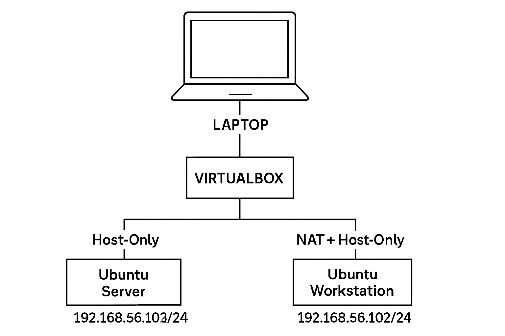
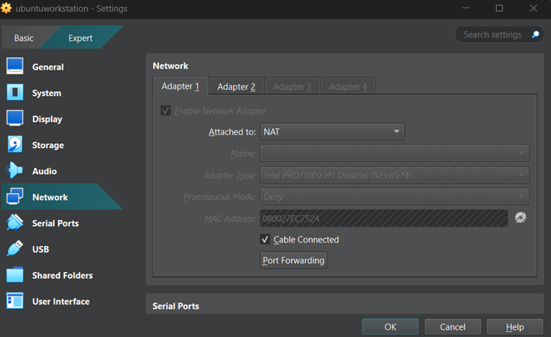
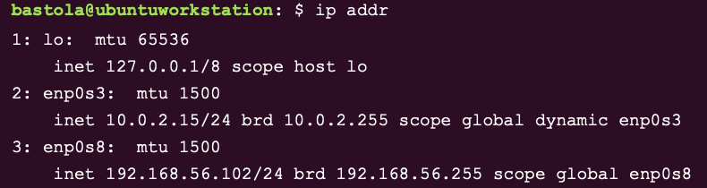
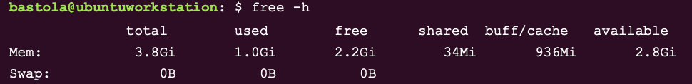

## Week 1 — System Architecture & Environment Planning

Home | Week 1 | Week 2 →

---

## Overview

Week 1 focuses on planning the system architecture and deployment environment for a Linux server before installation. This includes defining the host setup, virtualization strategy, network topology, and directory structure. The objective is to establish a clear, reproducible foundation that supports security, performance monitoring, and future scalability.

---

## Objectives

* Design the overall system architecture
* Select host OS and virtualization platform
* Define network configuration and addressing
* Plan directory structure and repository organization
* Prepare environment for secure remote management

---

## Deliverables

* System architecture diagram
* Virtualization and network design
* Planned directory and repository structure
* Evidence of host and VM environment setup

---

## 1. System Architecture Design

### 1.1 High-Level Architecture

**Architecture Description**

* Host machine runs macOS
* Virtualization provided via VirtualBox
* Ubuntu Server runs as a guest VM
* Management performed remotely via SSH
* Isolated host-only network for secure access

📸 **Screenshot / Diagram**
Filename: `week1-system-architecture.png`

```markdown

```

**Figure W1-1:** High-level system architecture showing host, virtual machine, and management access.

---

## 1.2 Host Environment

**Host System**

* Operating System: macOS
* Role: Development workstation and management console

**Responsibilities**

* SSH access
* Monitoring execution
* Evidence collection
* GitHub repository management

📸 **Screenshot**
Filename: `week1-host-info.png`

```markdown

```

**Figure W1-2:** Host system information confirming development environment.

---

## 2. Virtualization Platform

### 2.1 VirtualBox Configuration

* Virtualization Tool: VirtualBox
* Guest OS: Ubuntu Server LTS

**Planned VM Resources**

* CPU: 2 vCPUs
* Memory: 2–4 GB RAM
* Storage: 20–40 GB (VDI)

📸 **Screenshot**
Filename: `week1-virtualbox-vm-settings.png`

```markdown

```

**Figure W1-3:** VirtualBox VM configuration showing allocated CPU, memory, and storage.

---

### 2.2 Guest Operating System

**OS Selection Rationale**

* Ubuntu Server LTS
* Long-term support and stability
* Strong documentation and community
* Native AppArmor integration

📸 **Screenshot**
Filename: `week1-ubuntu-server-installed.png`

```markdown

```

**Figure W1-4:** Ubuntu Server successfully installed and booted.

---

## 3. Network Design

### 3.1 Network Topology

* Network Mode: Host-only Adapter

**Design Rationale**

* Isolated from public networks
* Secure management access
* Predictable IP addressing
* Suitable for testing and demonstrations

📸 **Screenshot**
Filename: `workstationnat.png`

```markdown

```

**Figure W1-5:** Host-only network configuration in VirtualBox.

---

### 3.2 IP Addressing Plan

| Component     | IP Address     |
| ------------- | -------------- |
| Workstation   | 192.168.56.102 |
| Ubuntu Server | 192.168.56.103 |

📸 **Screenshot**
Filename: `week1-ip-config.png`

```markdown

```

**Figure W1-6:** IP configuration verification on Ubuntu Server.

---

## 4. Directory & Repository Structure

### 4.1 Planned Server Directory Structure

```
/opt/project/
├── scripts/
├── data/
├── logs/
└── backups/
```

**Purpose**

* `scripts/`: Monitoring and automation scripts
* `data/`: CSV outputs and performance metrics
* `logs/`: System and application logs
* `backups/`: Configuration backups

📸 **Screenshot**
*(if you have one, add it here using same pattern)*

---

### 4.2 GitHub Repository Structure

```
repo-root/
├── README.md
├── docs/
│   └── week1.md
├── imagescreenshots/
│   └── week1/
└── scripts/
```

📸 **Screenshot**
*(add repo screenshot here if available)*

---

## 5. Remote Management Plan

**SSH Access Strategy**

* SSH enabled on Ubuntu Server
* Key-based authentication planned (Week 2)
* Access restricted to host IP

**Used for**

* Monitoring
* Configuration
* Evidence collection

---

## Evidence: System Commands

📸 **uname -a**
Filename: `uname -a.png`

```markdown

```

📸 **free -h**
Filename: `free -h.png`

```markdown

```

📸 **df -h**
Filename: `df -h.png`

```markdown

```

---

## Learning Objectives Achieved

✅ Infrastructure planning before deployment
✅ Understanding virtualization and networking concepts
✅ Designing secure-by-default environments
✅ Structuring technical documentation

---

## References

* VirtualBox Documentation
  [https://www.virtualbox.org/manual/](https://www.virtualbox.org/manual/)

* Ubuntu Server Documentation
  [https://documentation.ubuntu.com/server/](https://documentation.ubuntu.com/server/)

---

## Week 1 | Week 2 →


