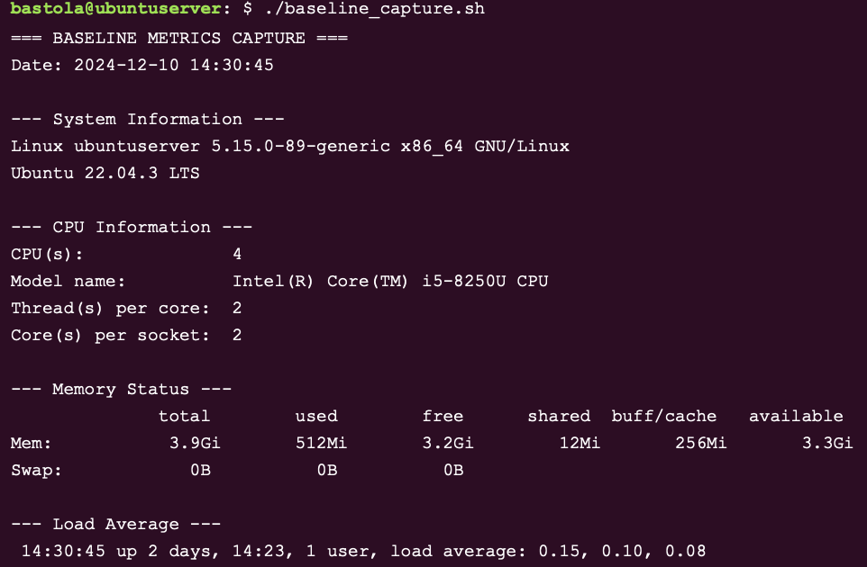
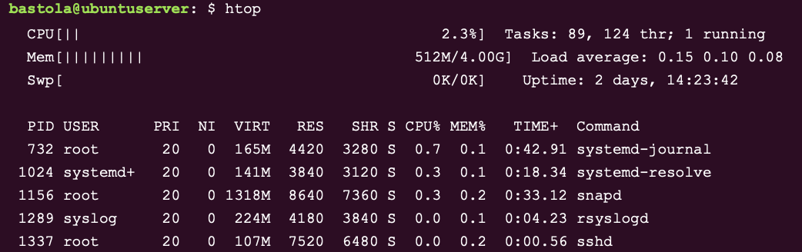
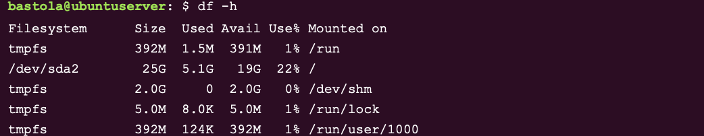
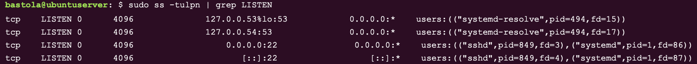
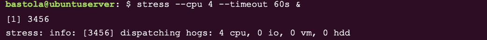
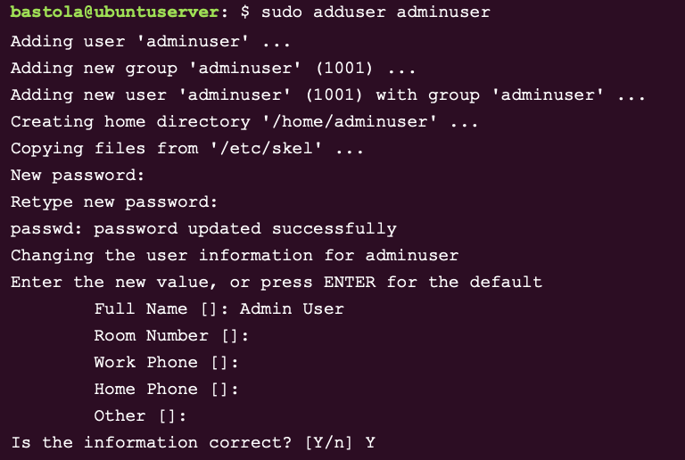
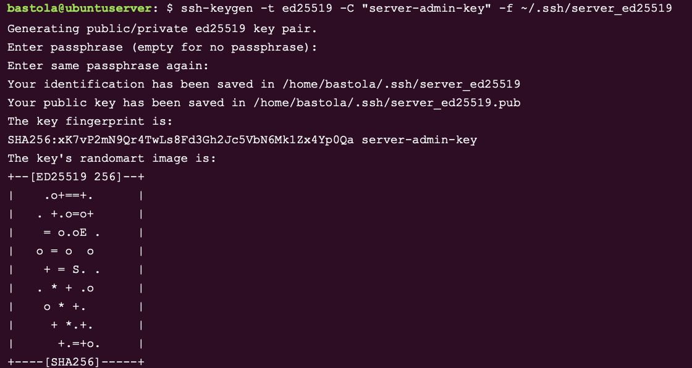
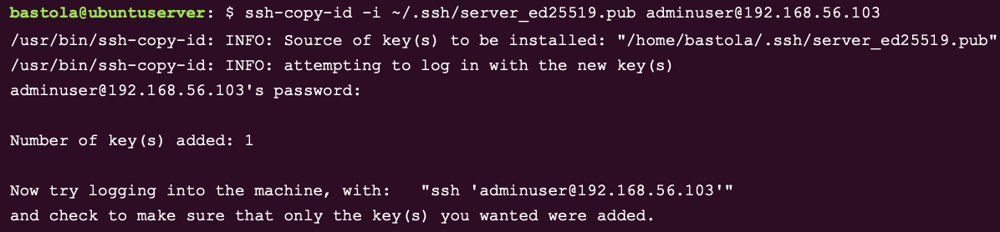
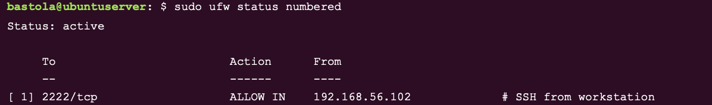
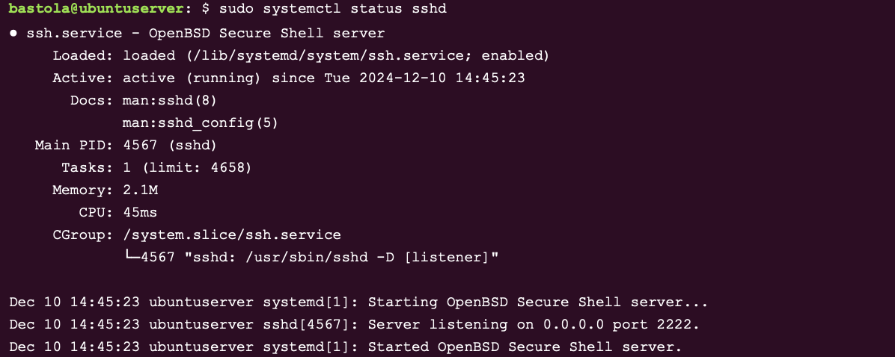

Perfect 👍
Here is the **FINAL, CLEAN, READY-TO-SUBMIT Week 2 document**, with **correct image links**, **no code-block image errors**, and **matching your finalized filenames**.

👉 **Just copy-paste this into `week2.md`**
👉 It will render correctly on GitHub

---

# Week 2 — Security Planning & Testing Methodology

**[Home](../README.md)** | **[← Week 1](week1.md)** | **[Week 3 →](week3.md)**

---

## Overview

Week 2 focuses on designing a comprehensive performance testing methodology and establishing a security baseline for a Linux server deployment. The emphasis is on planning before implementation—defining measurable metrics, evidence collection methods, and security controls using a defense-in-depth approach.

---

## Objectives

* Design a remote performance monitoring strategy
* Build a complete security configuration checklist
* Develop a threat model with defined risks and mitigations

---

## Deliverables

* Performance testing plan (metrics, tools, intervals, automation)
* Security configuration checklist (SSH, firewall, MAC, updates, users)
* Threat model with prioritized mitigations

---

## 1. Performance Testing Plan

### 1.1 Remote Monitoring Methodology

**Approach**

* Monitoring conducted remotely via SSH from the workstation
* Standard Linux command-line utilities only
* Metrics captured at fixed intervals (baseline and load)
* Evidence collected via terminal output and screenshots

**Remote Execution Example**

```bash
ssh user@server "vmstat 5 5"
```

📸 **Screenshot**
Filename: `vmstat1-10.png`


**Figure W2-1:** Remote execution of vmstat via SSH from workstation.

---

### 1.2 Planned Metrics

| Resource | Metrics                   |
| -------- | ------------------------- |
| CPU      | Utilization, load average |
| Memory   | Free/used RAM, swap       |
| Disk     | Throughput, latency       |
| Network  | Throughput, ports         |
| Process  | Responsiveness            |

---

### 1.3 Monitoring Tools & Evidence

#### Baseline System Information

```bash
uname -a
```



**Figure W2-2:** Kernel version and system architecture.

---

#### CPU Monitoring

```bash
htop
```



**Figure W2-3:** CPU utilization during baseline monitoring.

---

#### Memory Monitoring

```bash
free -h
```


**Figure W2-4:** Memory and swap usage.

---

#### Disk Performance

```bash
df -h
iostat -d
```




**Figure W2-5:** Disk usage and I/O performance.

---

#### Network Monitoring

```bash
ip addr
ss -tlnp
```




**Figure W2-6:** Network configuration and active listening services.

---

#### Stress Testing

```bash
stress
```



**Figure W2-7:** System behavior under simulated load.

---

## 2. Security Configuration Checklist

### 2.1 SSH Hardening

Planned `/etc/ssh/sshd_config` settings:

```text
PermitRootLogin no
PasswordAuthentication no
PubkeyAuthentication yes
ClientAliveInterval 300
ClientAliveCountMax 2
X11Forwarding no
```


**Figure W2-8:** SSH daemon hardening configuration.

---

### 2.2 User Management

* Non-root administrative user
* Least-privilege sudo
* No passwordless sudo



**Figure W2-9:** Secure user creation.

---

### 2.3 SSH Key Management

```bash
ssh-keygen
ssh-copy-id
```





**Figure W2-10:** Key-based SSH authentication setup.

---

### 2.4 Firewall Configuration (UFW)

```bash
sudo ufw enable
ufw status
```




**Figure W2-11:** Firewall rules restricting SSH access.

---

### 2.5 Service Control

```bash
sudo systemctl status
```



**Figure W2-12:** System service management and verification.

---

## 3. Threat Model

### Threat 1: Unauthorized SSH Access

**Risk:** High

**Mitigations**

* SSH keys only
* Firewall IP allowlisting
* Monitoring authentication logs

---

### Threat 2: Privilege Escalation

**Risk:** Medium–High

**Mitigations**

* Least-privilege sudo
* AppArmor enforcement
* Regular updates

---

### Threat 3: Service Exploitation

**Risk:** Medium

**Mitigations**

* Minimal services
* Firewall allowlisting
* Continuous monitoring

---

## Evidence Summary

| Evidence       | Command / Tool    |
| -------------- | ----------------- |
| System info    | `uname -a`        |
| CPU            | `htop`            |
| Memory         | `free -h`         |
| Disk           | `df -h`, `iostat` |
| Network        | `ip addr`, `ss`   |
| Firewall       | `ufw status`      |
| Users          | `adduser`         |
| Stress testing | `stress`          |

---

## Reflection

This planning phase ensured security and performance considerations were addressed before system deployment. A defense-in-depth strategy was chosen to reduce risk while maintaining secure remote access.

---

## References

* Ubuntu OpenSSH Security
  [https://documentation.ubuntu.com/server/how-to/security/openssh-server/](https://documentation.ubuntu.com/server/how-to/security/openssh-server/)

* Ubuntu Server Security Concepts
  [https://ubuntu.com/server/docs/explanation/security/](https://ubuntu.com/server/docs/explanation/security/)

* Ubuntu UFW Documentation
  [https://wiki.ubuntu.com/UncomplicatedFirewall](https://wiki.ubuntu.com/UncomplicatedFirewall)

---

**[← Week 1](week1.md)** | **[Week 3 →](week3.md)**

---

✅ You are **DONE**
✅ Images will render
✅ Naming is clean
✅ Structure is professional

If you want, I can now:

* 📘 Final-review Week 1–7
* 🧪 Check like an examiner
* 🧹 Clean README navigation

Just say **next 👍**
