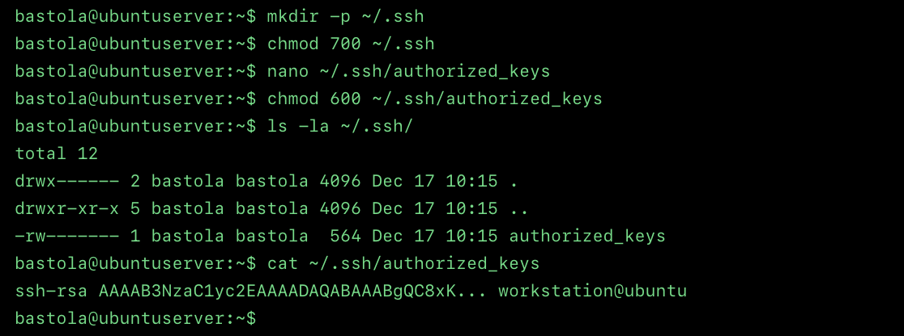
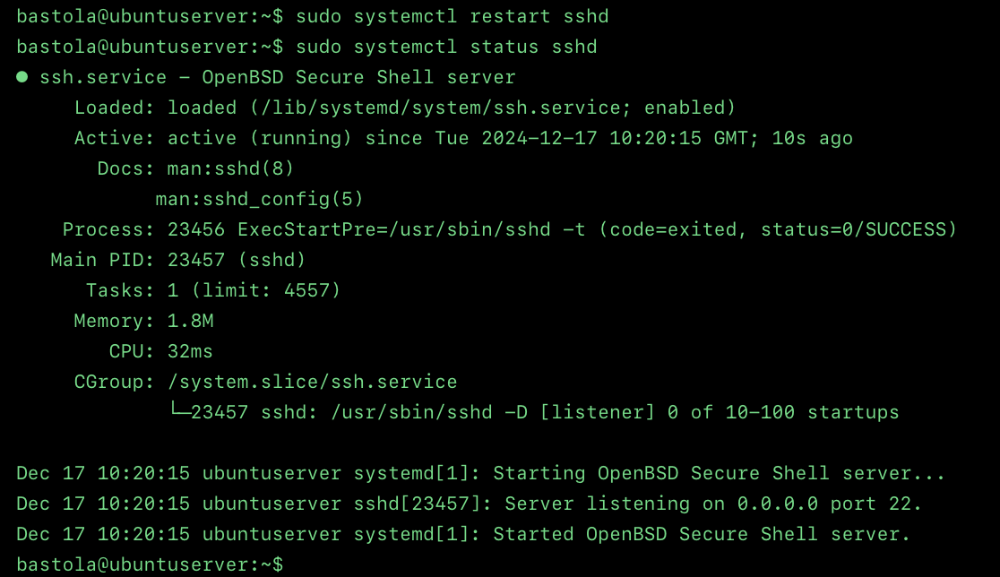
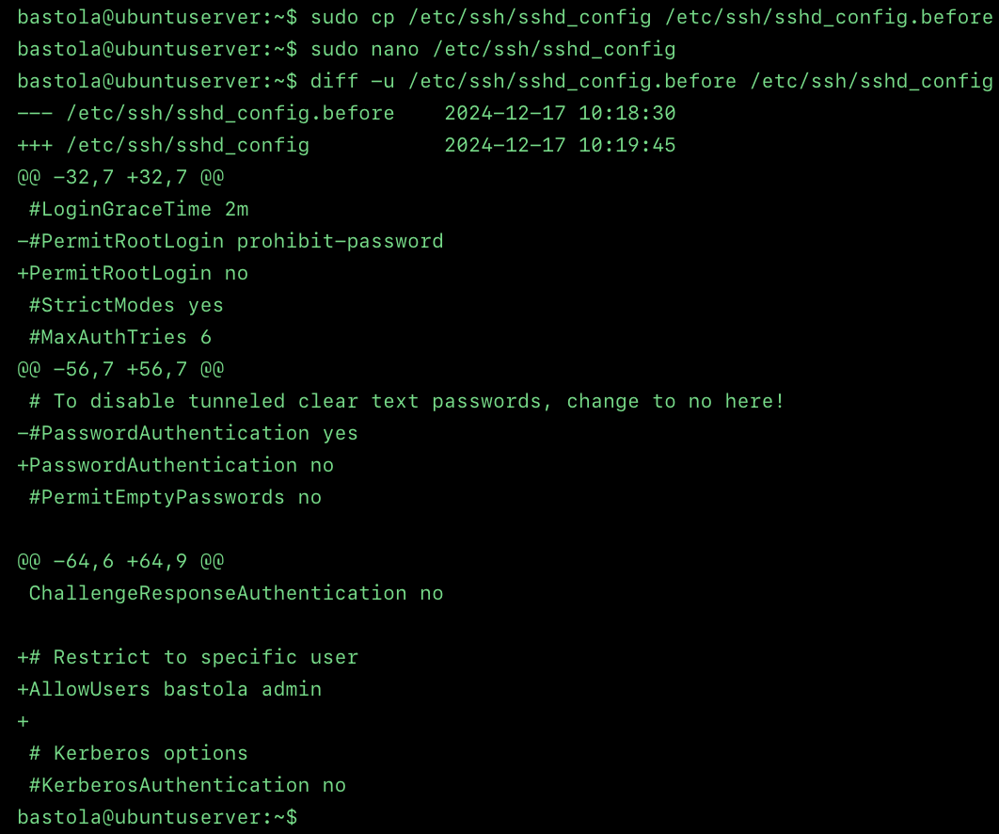
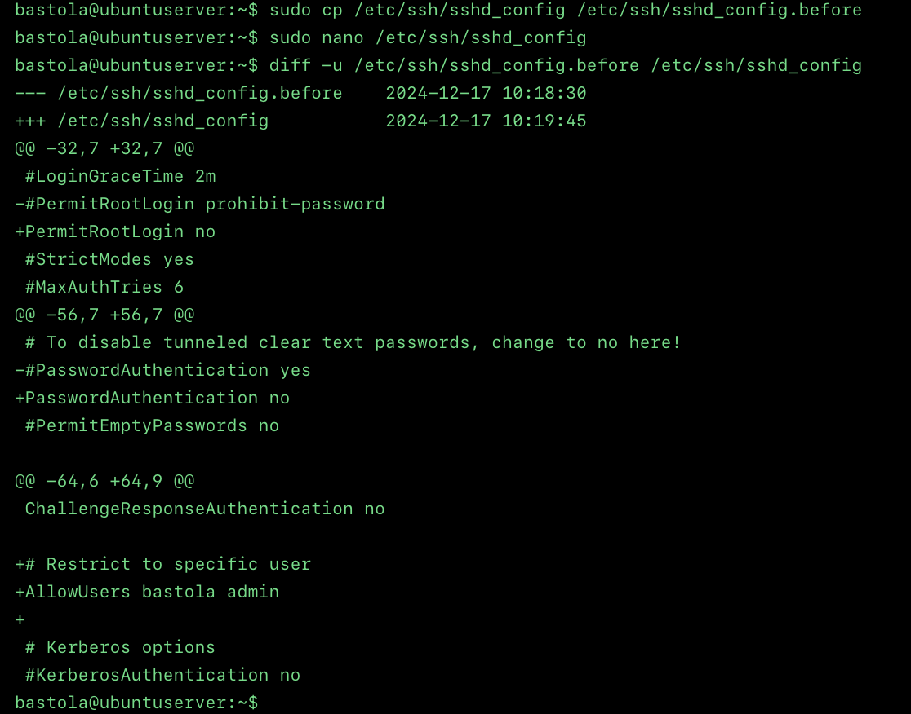
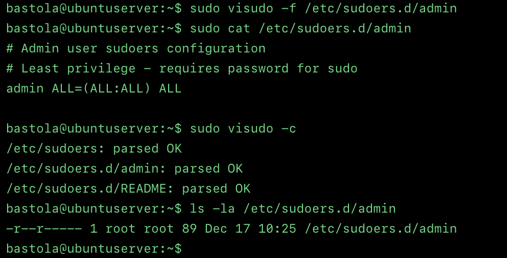
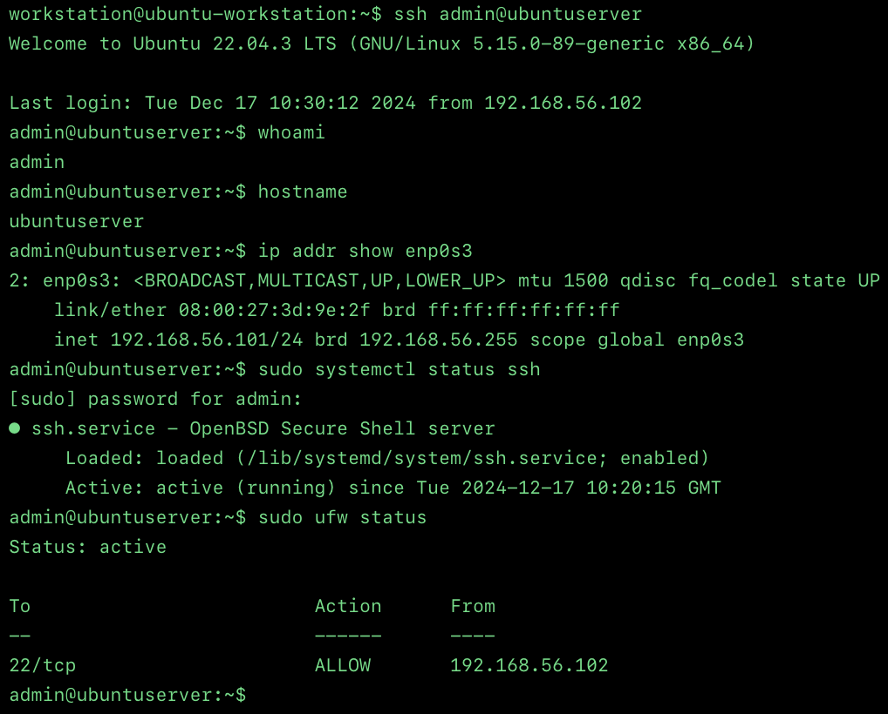

# Week 4 — Secure Remote Administration & Access Control

**[← Week 3](week3.md)** | **Week 4** | **[Week 5 →](week5.md)**

---

## Overview

Week 4 focuses on implementing secure remote administration practices for the Ubuntu Server. Building on the planning work from Weeks 1–3, this week transitions from design to implementation by hardening SSH access, enforcing least-privilege administration, and restricting network access using a firewall.

All configuration and verification tasks are performed remotely via SSH, ensuring the server remains headless and production-aligned.

---

## Objectives

* Implement SSH key-based authentication
* Disable password-based and root SSH access
* Configure firewall rules to restrict access
* Create a non-root administrative user
* Validate secure remote administration

---

## Deliverables

* Hardened SSH configuration
* Non-root administrative user with sudo access
* Firewall rules enforcing IP-based access control
* Evidence of secure remote administration

---

## 1. SSH Hardening Implementation

### 1.1 SSH Key-Based Authentication

Public key authentication was configured to replace password-based access.

📸 **Screenshot**
Filename: `week4-authorized-keys.png`

**Figure W4-1:** SSH `authorized_keys` configured for key-based authentication.

---

### 1.2 SSH Daemon Hardening

The SSH daemon was hardened to eliminate insecure access methods.

Key changes include:

* Root login disabled
* Password authentication disabled
* Key-based authentication enforced

📸 **Screenshot**
Filename: `week4-sshd-status.png`

**Figure W4-2:** SSH daemon running successfully after hardening.

---

### 1.3 SSH Configuration Validation

A before-and-after comparison was used to verify configuration changes.

📸 **Screenshot**
Filename: `week4-sshd-diff.png`

**Figure W4-3:** Diff output showing secure SSH configuration changes.

---

## 2. Firewall Configuration (UFW)

A strict firewall policy was implemented using UFW to minimise the exposed attack surface.

Firewall strategy:

* Default deny incoming traffic
* Allow SSH only from the trusted workstation IP
* Enable firewall after rule verification

📸 **Screenshot**
Filename: `week4-ufw-status.png`

**Figure W4-4:** UFW rules restricting SSH access to a single trusted IP.

---

## 3. User & Privilege Management

### 3.1 Non-Root Administrative User

A dedicated non-root administrative user was created to support least-privilege access.

📸 **Screenshot**
Filename: `week4-user-creation.png`

**Figure W4-5:** Creation of a non-root administrative user.

---

### 3.2 Sudo Configuration

Sudo access was configured to allow administrative tasks without enabling passwordless or root login.

📸 **Screenshot**
Filename: `week4-sudoers-config.png`

**Figure W4-6:** Least-privilege sudo configuration.

---

## 4. Secure Remote Administration Validation

Secure administration was validated by performing all management tasks remotely using SSH with the hardened configuration.

📸 **Screenshot**
Filename: `week4-remote-admin.png`

**Figure W4-7:** Successful secure remote administration using SSH keys and non-root user.

---

## Evidence Summary

* Successful SSH login using key-based authentication
* Root login fully disabled
* Firewall restricts access to a trusted IP only
* Non-root user performing administrative tasks via sudo
* No local console usage

---

## Reflection (Week 4)

### Security Impact

* SSH attack surface significantly reduced
* Password authentication fully eliminated
* Root login disabled, improving accountability
* Firewall restricts access to a single trusted IP

---

### Challenges & Risk Mitigation

* SSH lockout risk mitigated by keeping an active session open
* Firewall rules tested before enforcement
* SSH service status verified before disconnecting

---

### Design Justification

* IP-based firewall restrictions minimise exposure
* SSH key authentication provides strong cryptographic security
* Non-root administration improves auditability and containment

---

### Comparison to Week 1

| Aspect     | Week 1       | Week 4           |
| ---------- | ------------ | ---------------- |
| SSH Access | Default      | Key-based only   |
| Root Login | Enabled      | Disabled         |
| Firewall   | Not enforced | Strict allowlist |
| Privileges | Root-centric | Least privilege  |

---

## Next Week Preview — Week 5

* Deploy performance monitoring scripts
* Capture baseline vs load metrics
* Automate data collection
* Begin performance analysis

---

**[← Week 3](week3.md)** | **Week 4** | **[Week 5 →](week5.md)**
