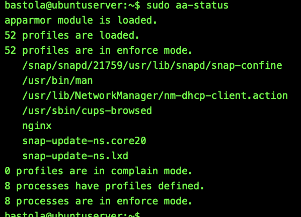
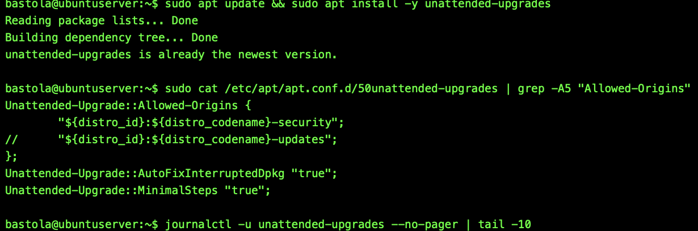
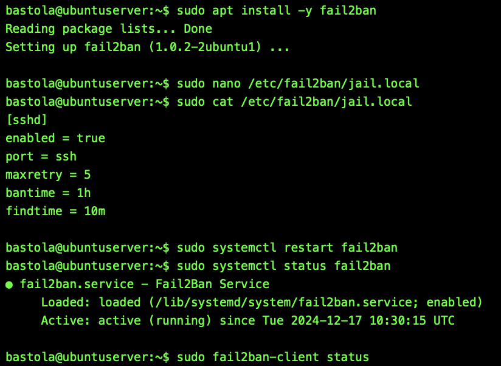
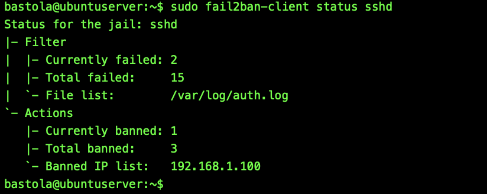
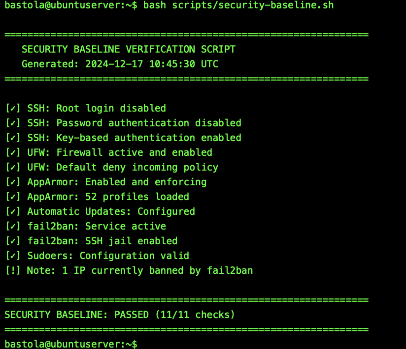
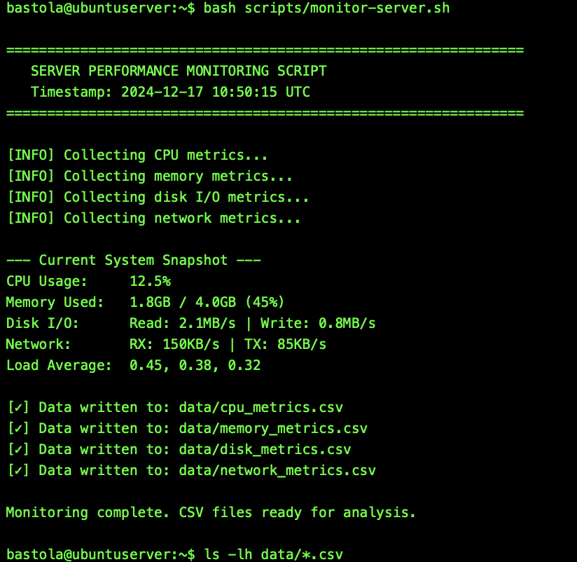
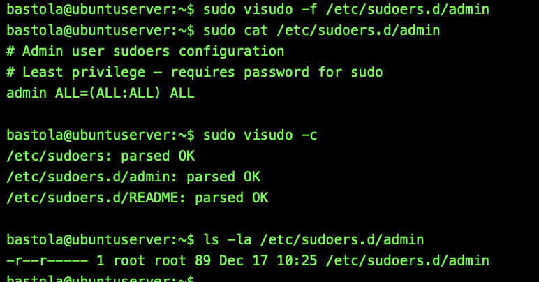

# Week 5 — Security Hardening & Performance Monitoring Automation

**[← Week 4](week4.md)** | **Week 5** | **[Week 6 →](week6.md)**

---

## Overview

Week 5 focuses on strengthening system security controls while implementing automated performance monitoring. Security mechanisms such as AppArmor, fail2ban, and unattended upgrades are enabled to harden the server, while lightweight monitoring scripts collect performance metrics for later analysis.

All configurations and scripts are managed remotely via SSH, maintaining a secure and headless server environment.

---

## Objectives

* Enforce Mandatory Access Control using AppArmor
* Mitigate brute-force attacks using fail2ban
* Enable automatic security updates
* Deploy automated performance monitoring scripts
* Generate structured performance data for analysis

---

## Deliverables

* AppArmor enforcement evidence
* fail2ban SSH jail configuration and status
* unattended-upgrades configuration
* Monitoring scripts and execution output
* Generated CSV performance data

---

## 1. Mandatory Access Control (AppArmor)

AppArmor was enabled to provide service-level confinement and reduce the impact of potential compromises.

📸 **Screenshot**
Filename: `week5-apparmor-statu.png`

**Figure W5-1:** AppArmor enforcing security profiles.

---

## 2. Automatic Security Updates

Unattended upgrades were configured to automatically install security patches.

📸 **Screenshot**
Filename: `week5-unattended-config.png`

**Figure W5-2:** unattended-upgrades configuration for automatic security updates.

---

## 3. Intrusion Prevention with fail2ban

fail2ban was deployed to monitor SSH login attempts and prevent brute-force attacks.

📸 **Screenshot**
Filename: `week5-fail2ban-jail.png`

**Figure W5-3:** fail2ban SSH jail configuration.

📸 **Screenshot**
Filename: `week5-fail2ban-status.png`

**Figure W5-4:** fail2ban service status confirming active protection.

---

## 4. Security Baseline Script

A security baseline script was executed to validate server hardening.

📸 **Screenshot**
Filename: `week5-security-baseline-output.png`

**Figure W5-5:** Security baseline script output.

---

## 5. Performance Monitoring Automation

Automated monitoring scripts were deployed to capture system metrics at defined intervals.

📸 **Screenshot**
Filename: `week5-monitor-script.png`

**Figure W5-6:** Execution of performance monitoring scripts.

---

## 6. CSV Performance Data

Metrics captured by monitoring scripts were stored in CSV format for analysis.

📸 **Screenshot**
Filename: `week5-csv-files.png`

**Figure W5-7:** Generated CSV files containing system performance data.

---

## 7. User Privileges

Least-privilege sudoers configuration was verified for non-root administrative users.

📸 **Screenshot**
Filename: `week5-sudoers-config.png`

**Figure W5-8:** Verified least-privilege sudo configuration.

---

## Reflection

* AppArmor enforces service-level confinement
* fail2ban mitigates brute-force SSH attacks
* Unattended-upgrades ensure timely patching
* Monitoring scripts designed for minimal impact
* Generated CSV data prepares for Week 6 analysis

---

## Navigation

← **[Week 4](week4.md)** | **Week 5** | **[Week 6 →](week6.md)**

