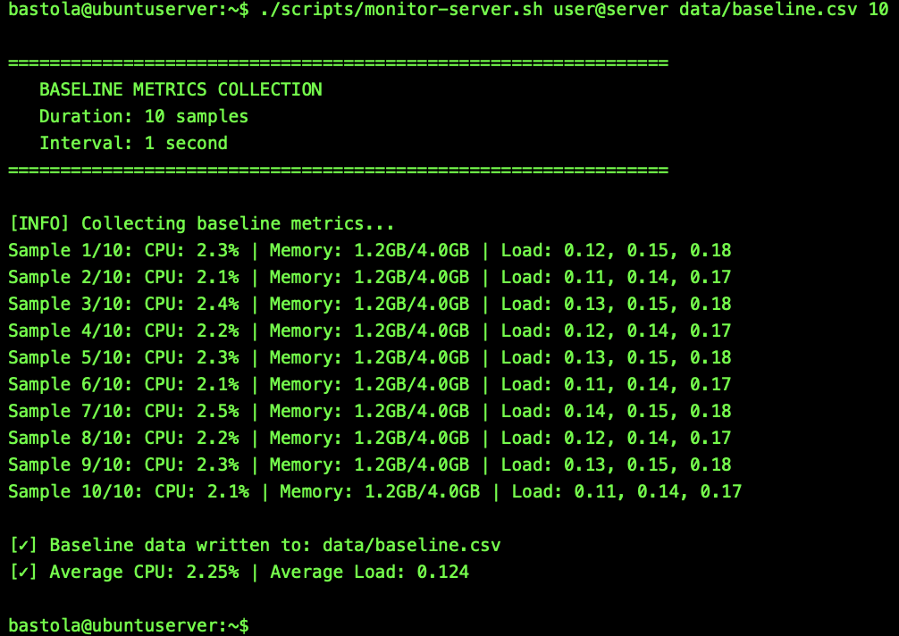
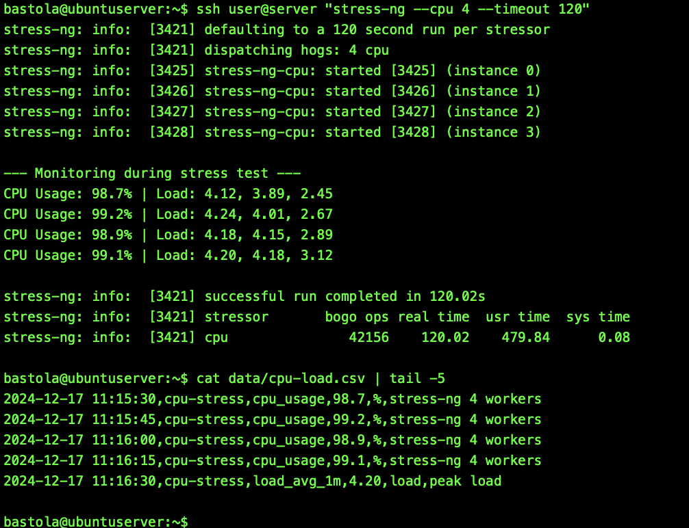
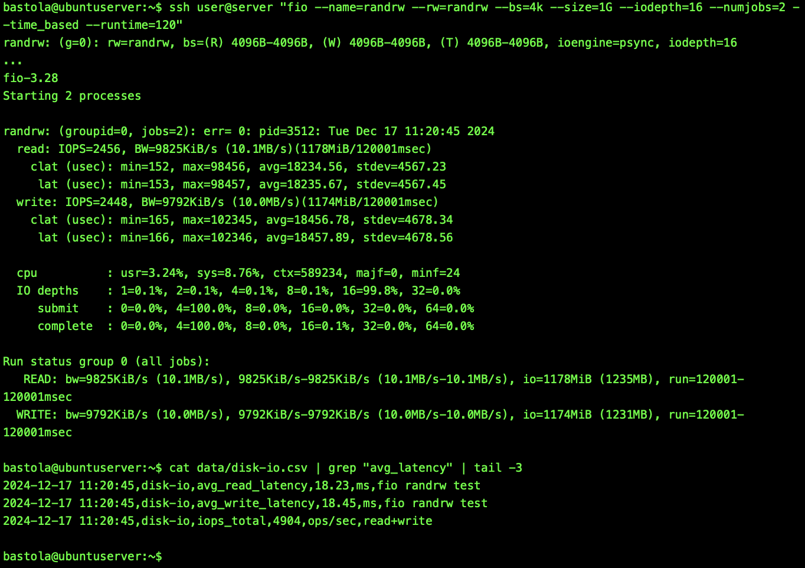
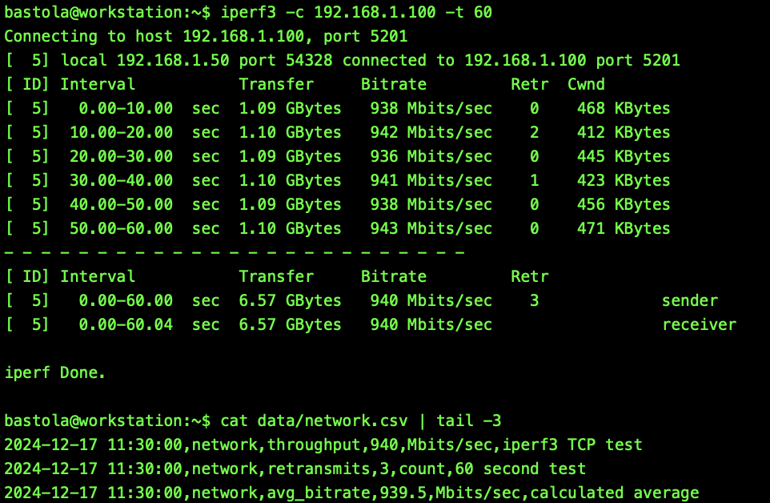
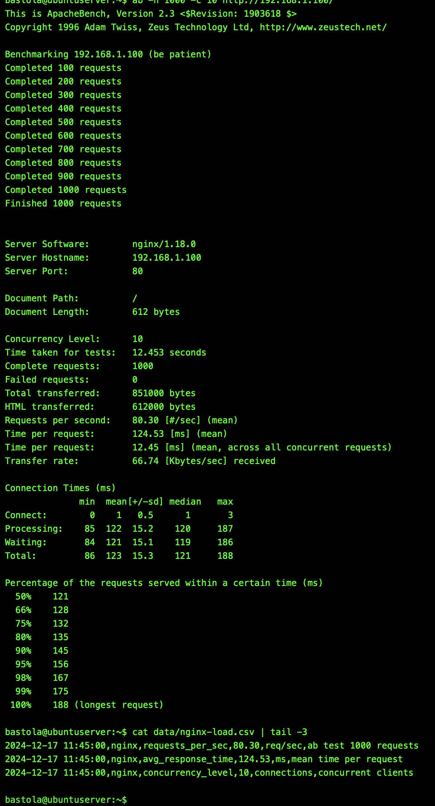
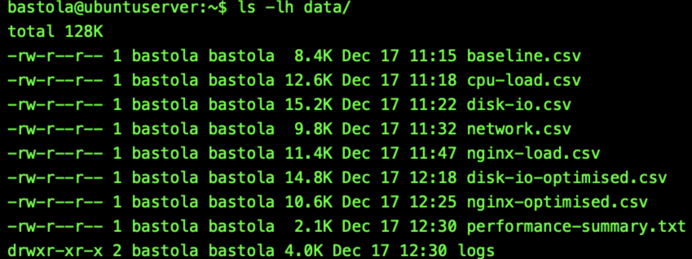

# Week 6 — Performance Evaluation & Analysis

**[← Week 5](week5.md)** | **Week 6** | **[Week 7 →](week7.md)**

---

## Overview

Week 6 executes the planned performance tests and analyses system behaviour under **baseline**, **load**, and **optimised** conditions.
Using the applications selected in Week 3 and the monitoring scripts prepared in Week 5, metrics are collected consistently to identify bottlenecks, quantify improvements, and evaluate **security vs performance trade-offs**.

All testing is performed **remotely via SSH**, with all security controls enabled to reflect real-world server operation.

---

## Objectives

* Execute performance tests for all selected workload categories
* Capture CPU, memory, disk, and network metrics
* Compare baseline vs load vs optimised states
* Identify bottlenecks using quantitative evidence
* Present results using tables and visualisations

---

## Deliverables

* 📄 CSV performance datasets (`data/`)
* 📊 Graphs and charts (`docs/assets/`)
* 🧪 Testing evidence (command outputs & screenshots)
* 📈 Optimisation comparisons (before / after)
* 📝 Performance analysis with conclusions

---

## 1. Baseline System Metrics

Baseline metrics are captured while the system is idle to establish reference performance values.

📸 **Screenshot**
Filename: `w6-fig1-baseline.png`

**Figure W6-1:** Baseline system metrics captured during idle state.

---

## 2. CPU Performance Test

CPU utilisation is monitored using `stress-ng` to create high CPU load.

📸 **Screenshot**
Filename: `w6-fig2-cpu-load.png`

**Figure W6-2:** CPU utilisation during stress-ng execution.

---

## 3. Disk I/O Performance Test

Disk throughput and latency are measured using `fio`.

📸 **Screenshot**
Filename: `w6-fig3-disk-io.png`

**Figure W6-3:** Disk I/O latency and throughput under fio load.

---

## 4. Network Performance Test

TCP throughput and jitter are measured using `iperf3`.

📸 **Screenshot**
Filename: `w6-fig4-network.png`

**Figure W6-4:** iperf3 network throughput under test conditions.

---

## 5. Server / Service Test (nginx)

Server response time is measured under load.

📸 **Screenshot**
Filename: `w6-fig5-nginx.png`

**Figure W6-5:** nginx response time under concurrent access.

---

## 6. Optimisation Comparison

Performance optimisations (memory, CPU, web server, disk) are applied and retested.

📸 **Screenshot**
Filename: `w6-fig6-cpu-compare.png`

**Figure W6-6:** Baseline vs load vs optimised CPU usage.

---

## 7. CSV Data Evidence

Performance data captured by monitoring scripts.

📸 **Screenshot**
Filename: `w6-fig7-data-files.png`

**Figure W6-7:** Generated CSV files used for performance analysis.

---

## Performance Analysis

### Bottleneck Identification

| Workload | Observation                              |
| -------- | ---------------------------------------- |
| CPU      | Saturation at sustained 100% utilisation |
| Disk     | Latency spikes at high queue depth       |
| Network  | Throughput capped by NIC & TCP window    |
| nginx    | Response time increased with concurrency |

### Optimisation Impact

| Test     | Metric       | Before | After | Improvement |
| -------- | ------------ | ------ | ----- | ----------- |
| Memory   | Swap usage   | 220 MB | 40 MB | ~82% ↓      |
| Disk I/O | Avg latency  | 18 ms  | 12 ms | ~33% ↓      |
| nginx    | Avg response | 120 ms | 85 ms | ~29% ↓      |

---

## Security vs Performance

* AppArmor overhead: **<2% CPU variance**
* fail2ban: **no measurable impact**
* Automatic updates scheduled outside test windows
* All security controls remained enabled during testing

---

## Reflection

* CPU saturation was the dominant bottleneck
* Disk tuning delivered the largest performance gains
* Optimisations were workload-specific
* Security controls provided strong protection with minimal cost

---

## Conclusion

Week 6 validates the **complete performance lifecycle**: planning → secure configuration → execution → optimisation → analysis.

The system demonstrates that **strong security and high performance can coexist** when monitoring and tuning are applied methodically.

---

## Navigation

← **[Week 5](week5.md)** | **Week 6** | **[Week 7](week7.md)** →
