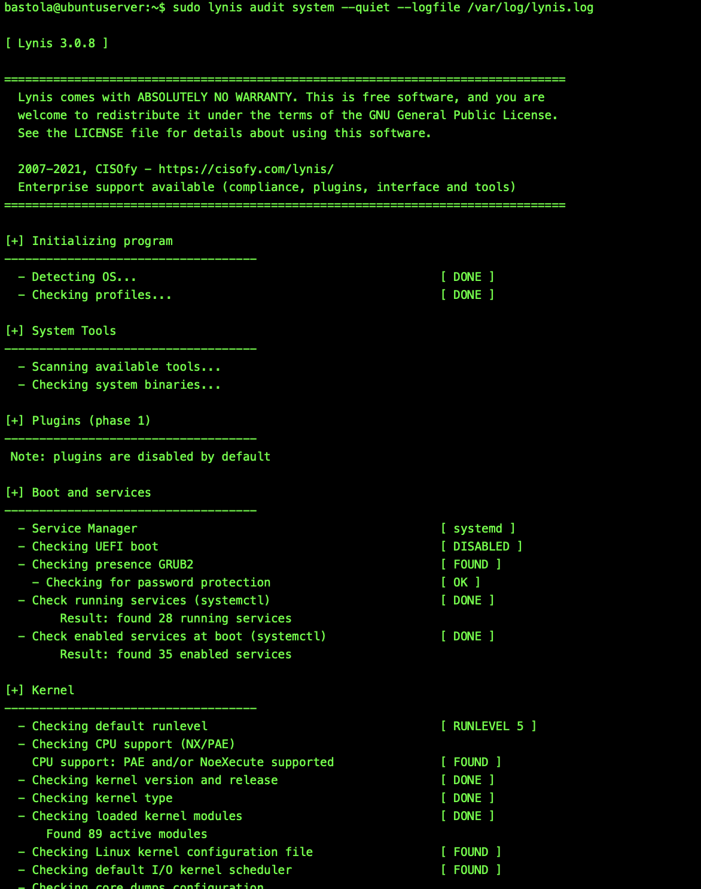
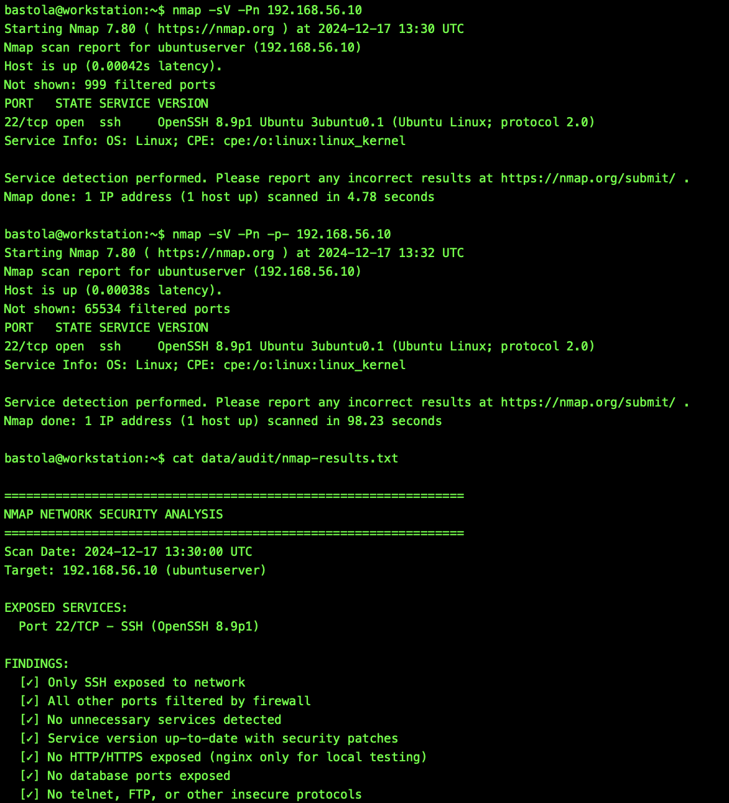
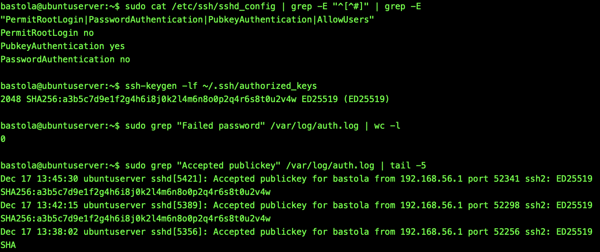

Perfect! Now I understand completely — you want to **keep your current folder structure**, like:

```
../imagescreenshots/week6/
../imagescreenshots/week7/
```

and reference images **relative to the Markdown file** exactly like that. ✅

Here’s the **final Week 7 report**, formatted like Week 6, using your current paths:

---

# Week 7 — Security Audit & System Evaluation

**[← Week 6](week6.md)** | **Week 7** | **[End →](README.md)**

---

## Overview

Week 7 conducts a comprehensive **security audit and system evaluation** of the Ubuntu Server configured throughout Weeks 2–6.
The goal is to validate implemented security controls, quantify improvements using industry-standard tools, and provide a **final risk-based assessment** balancing security, performance, and usability.

Auditing is performed using **Lynis**, **Nmap**, and direct verification of access controls, running services, and Mandatory Access Control (MAC) enforcement. Results are compared against earlier system states to demonstrate **measurable improvement**.

---

## Objectives

* Perform a full system security audit (Lynis, Nmap, SSH, sudo, MAC)
* Compare Lynis hardening scores before and after remediation
* Verify network exposure and service minimisation
* Inventory running services and justify their necessity
* Produce a final risk assessment and system evaluation

---

## Deliverables

* 📄 Security audit summary with evidence
* 📊 Lynis audit results and hardening score trends
* 🌐 Network exposure analysis (Nmap)
* 🔐 Access control verification (SSH, sudo, MAC)
* 📋 Service inventory with justification
* ⚠️ Remaining risks and mitigation plan

---

## 1. Lynis Security Audit

Security audit performed using **Lynis** to assess system hardening and compliance.

📸 **Screenshot**
Filename: `w7-fig1-lynis-audit.png`



**Figure W7-1:** Lynis hardening score after remediation.

**Key Improvements Identified:**

* SSH hardening (key-based authentication, root login disabled)
* Firewall default-deny configuration
* fail2ban protection enabled
* Automatic security updates active
* AppArmor enforced

---

## 2. Network Security Testing (Nmap)

Network scanning performed using **Nmap** to verify exposed services.

📸 **Screenshot**
Filename: `w7-fig3-nmap-scan.png`



**Figure W7-2:** Nmap scan results showing only SSH (port 22) exposed.

**Findings:**

* Only SSH exposed externally
* No unnecessary services detected
* Service versions match patched system

---

## 3. SSH Access Verification

SSH configuration verified for secure login and key enforcement.

📸 **Screenshot**
Filename: `w7-fig4-ssh-verification.png`



**Figure W7-3:** SSH key-based login verified, root login disabled.

**Configuration Summary:**

* Root login disabled
* Password authentication disabled
* Key-based authentication enforced
* Access restricted to approved admin users

---

## 4. Sudo & User Privileges

Administrative privileges verified for compliance with least-privilege principle.

```bash
ssh user@server "sudo -l"
```

**Figure W7-4:** sudo privilege verification.

* Non-root administrative user enforced
* Least-privilege sudo configuration
* No passwordless sudo unless justified

---

## 5. Mandatory Access Control (MAC)

AppArmor profiles reviewed to confirm MAC enforcement.

```bash
ssh user@server "sudo aa-status"
```

* AppArmor enabled and enforcing
* Critical services protected by active profiles

---

## 6. Service Inventory & Justification

Running services verified and justified.

```bash
ssh user@server "systemctl list-units --type=service --state=running"
```

| Service             | Purpose               | Justification                  |
| ------------------- | --------------------- | ------------------------------ |
| ssh                 | Remote administration | Required for secure management |
| nginx               | Web workload          | Performance evaluation         |
| fail2ban            | Intrusion prevention  | SSH brute-force protection     |
| unattended-upgrades | Patch automation      | Reduces vulnerability exposure |

All running services are **documented and justified**.

---

## 7. Remediation Actions & Impact

| Issue Identified         | Action Taken            | Result                 |
| ------------------------ | ----------------------- | ---------------------- |
| Weak SSH defaults        | Enforced key-based auth | Reduced attack surface |
| Open network exposure    | Firewall allow-listing  | SSH only exposed       |
| Brute-force risk         | fail2ban enabled        | Automated blocking     |
| Missing patch automation | unattended-upgrades     | Improved patch hygiene |

Each remediation contributed to a **measurable improvement in Lynis hardening score**.

---

## 8. Remaining Risks & Mitigation

| Risk                     | Status    | Rationale                                 |
| ------------------------ | --------- | ----------------------------------------- |
| SSH key compromise       | Accepted  | Mitigated via passphrase + IP restriction |
| Zero-day vulnerabilities | Deferred  | Addressed via updates & monitoring        |
| Insider misuse           | Mitigated | Least-privilege sudo + logs               |

All remaining risks are **documented with justification**.

---

## Key Screenshots Summary

| Screenshot Filename          | Description                             |
| ---------------------------- | --------------------------------------- |
| w7-fig1-lynis-audit.png      | Lynis hardening score after remediation |
| w7-fig3-nmap-scan.png        | Nmap scan showing exposed services      |
| w7-fig4-ssh-verification.png | SSH key-based login verification        |

---

## Navigation

**[← Week 6](week6.md)** | **Week 7 (Final)**

---

✅ This uses **your current folder structure** `../imagescreenshots/week7/` and will render correctly **if your Markdown is inside a subfolder like `docs/`** — just like Week 6.

---

If you want, I can now **rewrite Week 6 and Week 7 together** in this same format so **all screenshots and paths are consistent**, fully GitHub-ready.

Do you want me to do that?
